# Serverless Image Processing – AWS Project  
A serverless solution that processes images automatically using **Amazon S3**, **AWS Lambda**, **Amazon DynamoDB**, and **Amazon API Gateway**.

This README covers the full deployment steps, project structure, and screenshots documenting the setup.

# Project Structure

serverless-image-processing/
│
├── api-gateway/ # API Gateway routes & configs
├── dynamodb-schema/ # DynamoDB table definition
├── lambda/ # Lambda Functions (code + layers)
├── test-images/ # Sample images for testing
├── extras/ # All screenshots (AWS console)
└── Readme.md # This documentation

# 1. Architecture Overview

# 2. AWS Services Used

### **🔹 Amazon S3**
- Stores input images  
- Stores processed output images  
- Triggers Lambda when a new file is uploaded  

### **🔹 AWS Lambda**
- Automatically processes images using Pillow  
- Writes metadata to DynamoDB  
- Handles API Gateway requests  

### **🔹 Amazon DynamoDB**
- Stores image metadata (filename, size, timestamp, status)

### **🔹 Amazon API Gateway**
- Optional REST API to query processed images

---

# 3. Implementation Steps

## **3.1 Create S3 Buckets**

1. Create an **Input Bucket**  
2. Create an **Output Bucket**

Screenshot:  
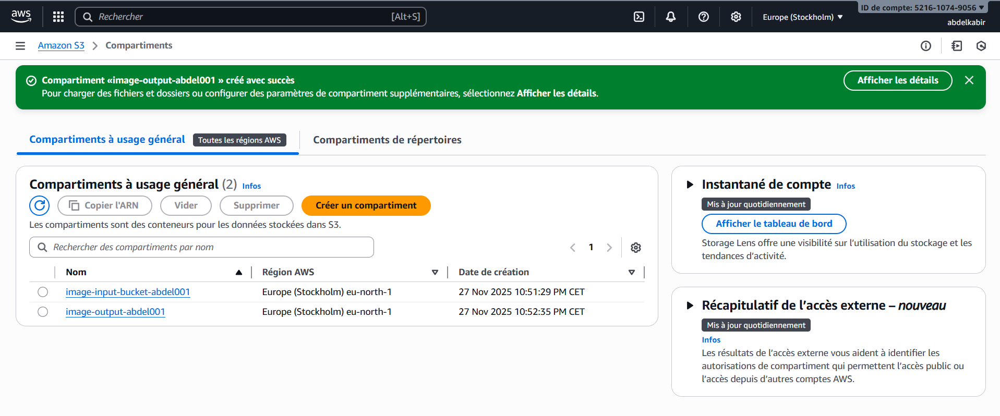

---

## **3.2 Create IAM Role for Lambda**

The role must include:

- **AWSLambdaBasicExecutionRole**
- **AmazonS3FullAccess**
- **AmazonDynamoDBFullAccess**

Screenshots:  
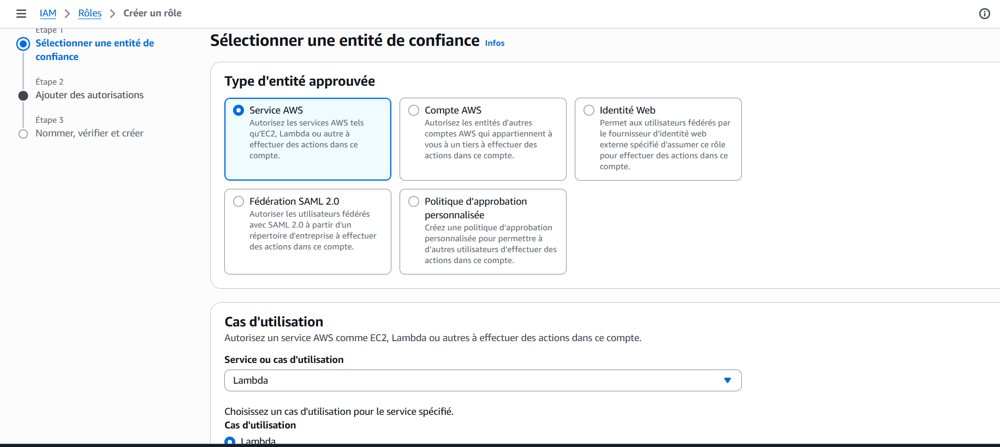  
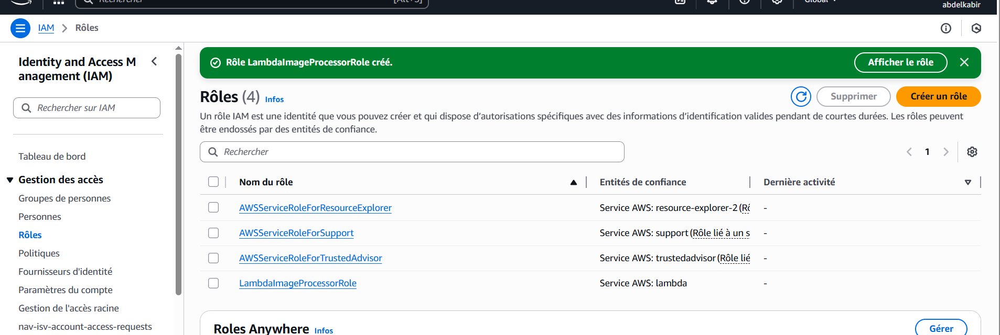  
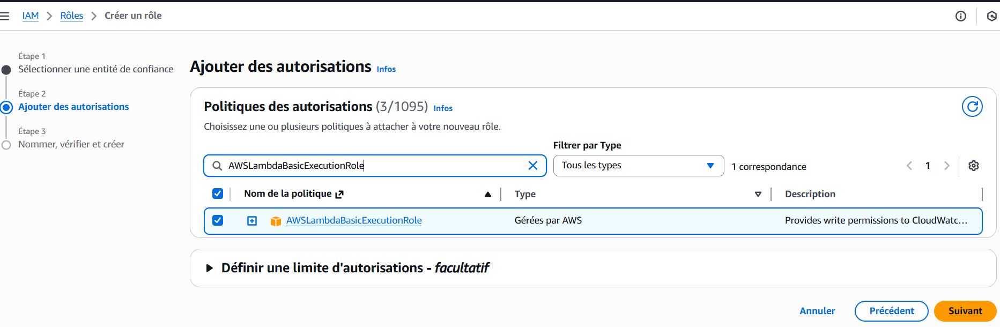  
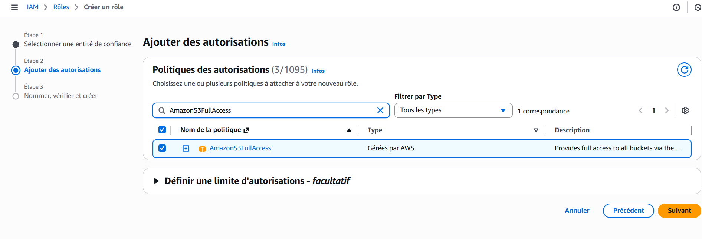  
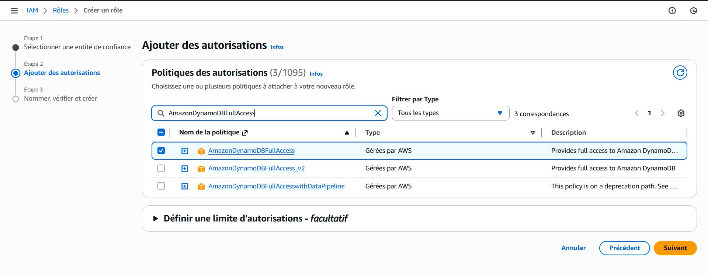

---

## **3.3 Create the Lambda Function**

### Steps:
1. Create a new Lambda function (Python 3.x)  
2. Select the IAM role you created  
3. Upload your Lambda code  
4. Add Pillow via AWS Lambda Layer  

Screenshots:  
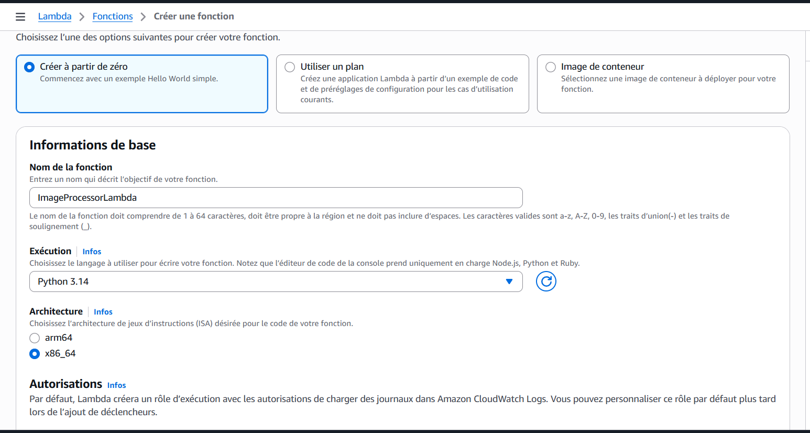  
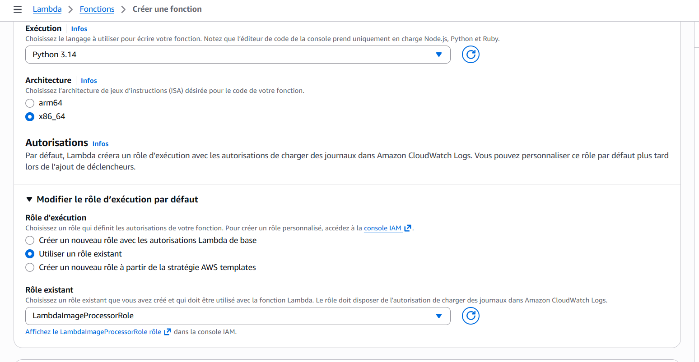  
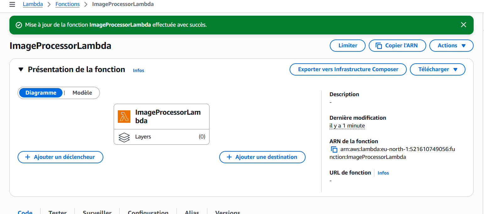  
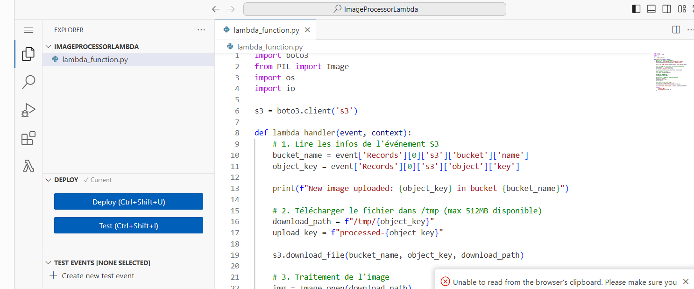

---

## **3.4 Configure S3 Event Notification**

When a new object is uploaded to the input bucket → trigger the Lambda function.

Screenshots:  
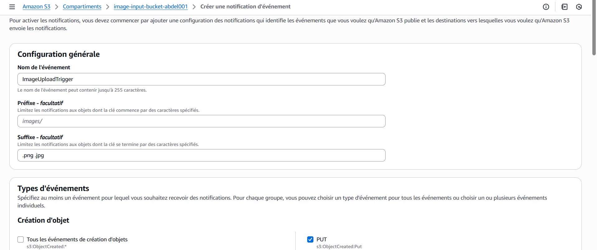  
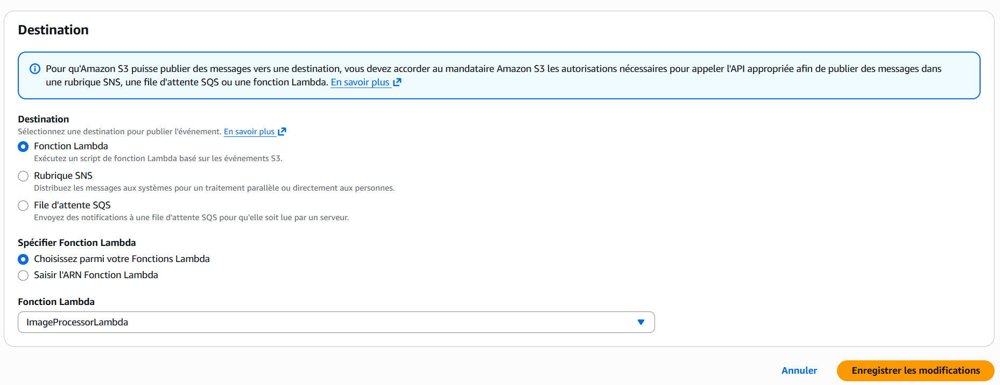  
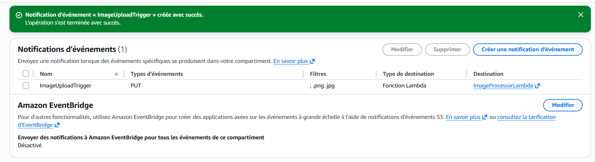

---

## **3.5 Create DynamoDB Table**

Example configuration:

- **Table name:** `ImageMetadata`
- **Primary key:** `imageId` (String)

Screenshots:  
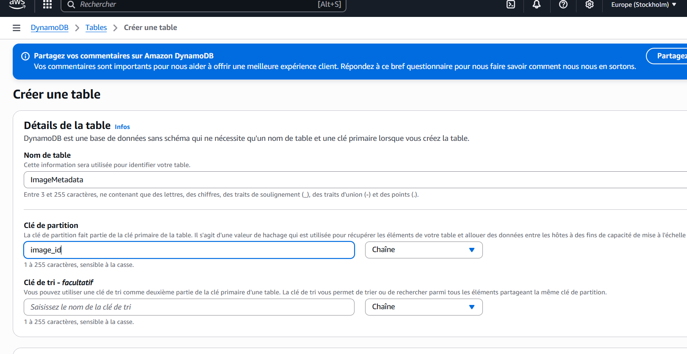  
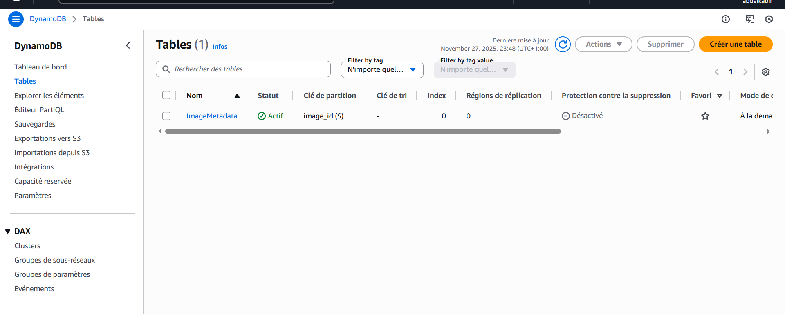

---

## **3.6 Test the Pipeline**

Upload a sample image to the **input bucket**.

Example test file:  
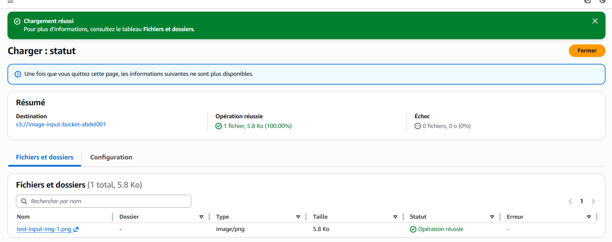

Lambda will automatically:

- Read the uploaded image  
- Process it (resize/convert)  
- Save the processed output to the **output bucket**  
- Store metadata in DynamoDB  
- Log execution details in CloudWatch  

CloudWatch Logs:  
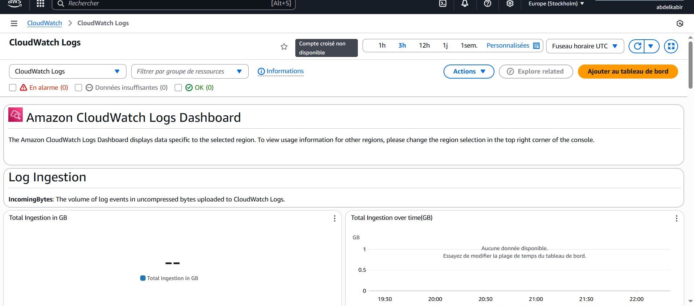

---

# 📌 4. API Gateway (Optional)

The API can be used to:

- Query processed images  
- Retrieve metadata from DynamoDB  
- Access processed images programmatically  

📁 Documentation for API is available in:  
api-gateway/

# 5. Test Images

Place all test images inside:

test-images/

#  7. Future Improvements

- Add authentication (Cognito / IAM)  
- Add CloudFront for CDN delivery  
- Add multi-stage processing using Step Functions  
- Add watermarking, OCR, or face detection  

---

# Project Completed

This end-to-end serverless pipeline is fully automated, scalable, and production ready.

Need more?

- Architecture Diagram  
- A full GitHub template  
- A PDF export of this README  

Just ask!  